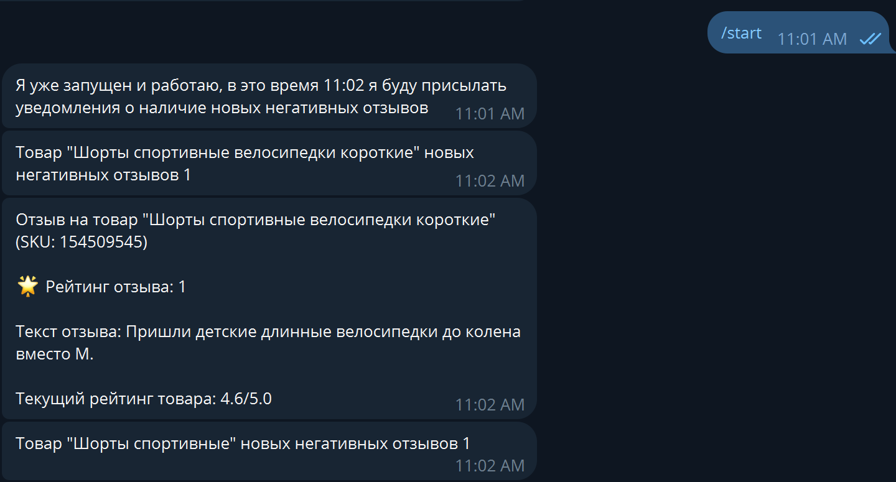

# Бот по ТЗ:

Здравствуйте,
Внимательно прочтите задание.
Если есть вопросы по заданию, то спрашивать ответным письмом (сохраняя цепочку писем).
Если вопросов нет, то напишете в ответ на данное письмо время, которое вам потребуется на выполнение данной задачи.
Выполните задачу.
По выполнению задачи выложить результат работы ответным письмом.

Задание: в группу Телеграмм должны поступать уведомления о негативном отзыве на товар в Wildberries.

Входные данные: список SKU товаров в файле Excel. SKU - это основной id товаров в WB. Используется, например, в адресе карточки товара: https://www.wildberries.ru/catalog/154509545/detail.aspx. Пример списка: 54978961; 18902880; 63956972; 39374520. Можете взять любые SKU.

Сообщение следующего содержания (ориентировочно): "Негативный отзыв/название товара/SKU товара/столько-то звезд (от 4х до 1ой)/ текст отзыва/Текущий рейтинг товара."

Методы мониторинга (на выбор, можно сделать по-своему):
1) парсинг страниц карточек товара.
2) использование API  сайта или приложения WB. Описания нужных запросов нет, но через инспектор кода в браузере или другими способами их можно изучить.

Выполнять: регулярно по расписанию (достаточно предложить и описать метод запуска).

 Задание выполнить на Python.

Удачи!
Сергей Андреевский

## Установка

Для работы требуется Python 3.10+. Скопируйте проект и установите зависимости:

Создание виртуального окружения 
```bash
python -m venv venv
```
Активация виртуального окружения 
```bash
.\venv\Scripts\activate
```
Установка зависимостей
```bash
  pip install -r requirements.txt
```


## Логика бота такова:
Бот обращается по API к WB и достаёт отуда JSON нужной информацией.

Далее бот сохраняет данные в json файл (папка backups) и сравнивает сохранённый файл с новыми отзывами.

Если есть различия т.е. появился новый отзыв то бот об этом уведомляет.

## И так, для работы бота нам понадобится установить свои значения в файл config.py, ниже пояснения что к чему:

Токен бота
**TOKEN**

Здесь хранятся бэкапы отзывов, нужно указать абсолютный путь.
**BACKUPS_PATH**

Время, в которое скрипт будет проверять наличие новых сообщение формат 24 часовой например(01:03, 11:30).
**TIME**

Здесь хранится эксель документ со SKU товаров, нужно указать абсолютный путь.
**EXCEL_PATH**

## Запуск бота
```bash
python main.py
```

после в боте отправляем **/start**


# ВАЖНО

При первом запуске бот уведомит "новых негативных отзывов нет" для каждого товара.
Так нужно, бот сохраняет сначала все отзывы которые есть на текущий момент и не проверяет их.
Бот уже будет в будущем ловить новые отзывы и присылать уведомление.

## Как проверить работу бота

зайдите в папку /backups в проекте (после первичного запуска бота).
Там будут бэкапы в с названиями {айди товара}_backups.

**УДАЛИТЕ некоторые значения в этих файлах, то есть отзывы, чтобы отследить как бот отреагирует на изменения 
в файле (когда придёт время -- TIME в config.py)**

Чтобы не ждать целый день измените TIME в config.py на пару минут вперёд текущего времени,
перезапустите бота обязательно
и нажмите снова 
**/start** в переписке с ботом и тогда в указанное время бот уведомит о том что появились новые отзывы (в нашем 
случае те которые мы удалили)




## Контакты

Разработчик: Алексей

TG: [@Bbylba4ka](https://t.me/Bbylba4ka)

GitHub: https://github.com/Bylba4kka/